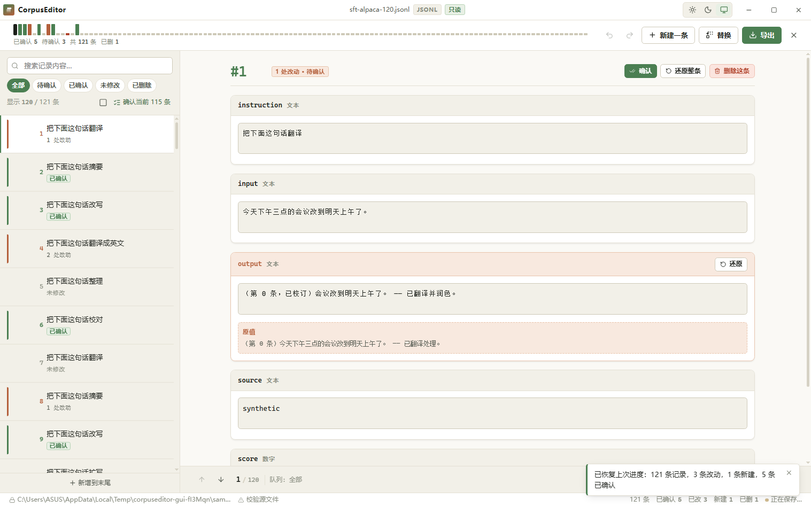
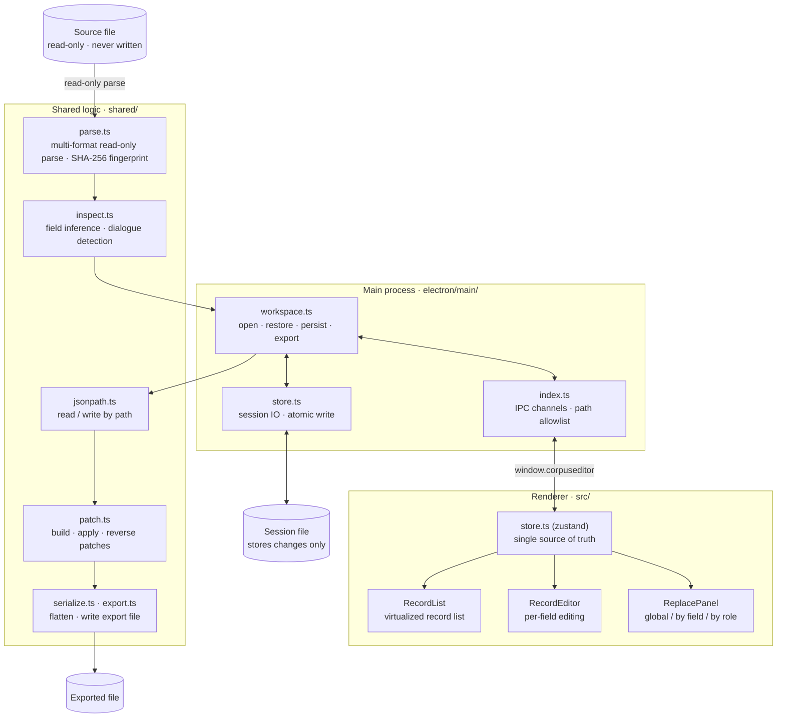

# CorpusEditor

<div align="center">
    
</div>


A desktop editor for LLM instruction-tuning datasets — read-only import, per-record editing, batch replace, and resumable progress that never touches your source file.

English | [简体中文](./README.zh-CN.md)

    [](./LICENSE) [](https://github.com/Mokuringo/CorpusEditor/actions/workflows/ci.yml)

> All code in this repository was generated by AI. It contains no human-written code and has not been reviewed by a human. Use it at your own risk.

## Overview

CorpusEditor is a desktop editor for **LLM instruction-tuning datasets** (SFT / DPO). It opens your dataset read-only, lets you fix and rewrite records one by one or in bulk, and exports a clean copy — **your original file is never modified**.

Fine-tuning datasets are often large and messy. You need to proofread records, rewrite prompts in batch, and safely export the result without ever risking the source data. That is exactly what CorpusEditor is built for.

## Features

- **Read-only source.** The source file is opened read-only. CorpusEditor records only *what changed* (patches) in an independent workspace and writes a brand-new file on export.
- **Per-record editing.** Every field of every record is editable in a clear, virtualized editor.
- **Batch replace.** Global find-and-replace, plus scoped replace **by field** or **by dialogue role** (system / user / assistant / tool).
- **Resumable progress.** Edits are saved to a workspace tied to the source file. Reopen the same file and your work is restored; survive a crash and keep going.
- **Multi-format.** JSONL, JSON arrays, CSV, YAML, and Parquet in; clean data out.
- **Mark-for-deletion.** Flag records to drop from the export without deleting anything from the source.
- **Light / dark themes.** A modern UI that follows your system or your choice.
- **Source integrity.** A SHA-256 fingerprint check proves the source file hasn't been touched.

## Screenshots



*The core editing page: a virtualized record list, per-field editing, and role-colored message bands.*

## Supported formats

| Format | Extensions | Notes |
|---|---|---|
| JSONL / NDJSON | `.jsonl` `.ndjson` `.jl` | one JSON object per line |
| JSON | `.json` | an array of objects |
| CSV / TSV | `.csv` `.tsv` `.tab` | header row maps to fields |
| YAML | `.yaml` `.yml` | an array of mappings |
| Parquet | `.parquet` | columnar; read-only import |

## Quick start

### Download a prebuilt binary

Head to the [Releases](https://github.com/Mokuringo/CorpusEditor/releases) page and grab the installer for your platform.

### Build from source

Prerequisites: **Node 22+** and npm.

```bash
git clone https://github.com/Mokuringo/CorpusEditor.git
cd CorpusEditor
npm install
npm run build
npm start
```

## Building & packaging

```bash
npm run build      # electron-vite build → out/
npm run dist       # electron-builder → installer in dist/
```

## Architecture

Three layers, kept strictly separate. The renderer never touches the file system — every IO goes through `window.corpuseditor`.



## Testing

| Tier | Command | Scope |
|---|---|---|
| Type check | `npx tsc --noEmit -p tsconfig.json` | full project |
| Unit | `npm run test` | logic, node environment |
| Smoke | `npm run smoke` | real main process + a fake Electron |
| GUI | `npm run gui` | real Electron + CDP |

## License

[MIT](./LICENSE)
