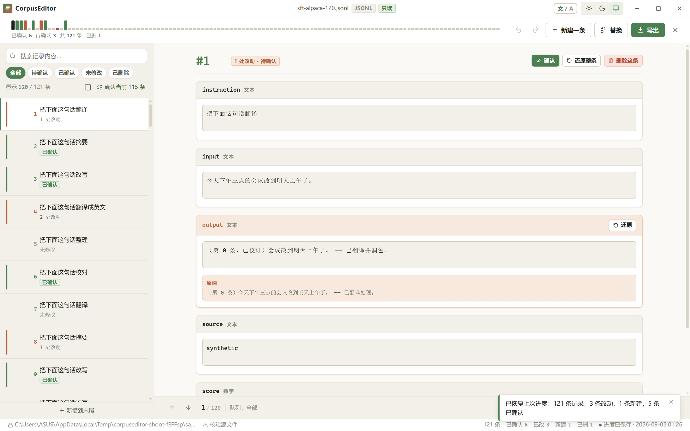
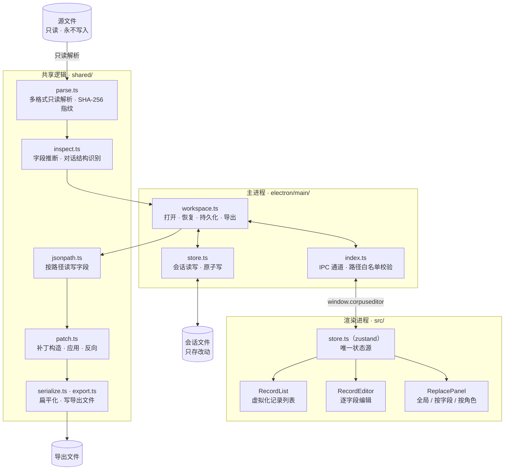

# CorpusEditor

<div align="center">
    
</div>

LLM 指令微调数据编辑器 —— 只读导入、逐条编辑、批量替换，进度可恢复，且永不动你的源文件。

[English](./README.md) | 简体中文

    [](./LICENSE) [](https://github.com/Mokuringo/CorpusEditor/actions/workflows/ci.yml)

> 本项目**所有代码均由 AI 生成**，不含任何人工编写的代码，也未经任何人工审查。请在充分理解风险的前提下使用。

## 项目简介

CorpusEditor 是一款面向 **LLM 指令微调数据集**（SFT / DPO）的桌面端编辑器。它以只读方式打开你的数据集，支持逐条或批量校订，并导出一份干净的结果——**原始文件永不被修改**。

微调数据集往往又大又脏：你需要逐条校对、批量改写 prompt，再把结果安全地导出，同时绝不能碰坏原始数据。这正是 CorpusEditor 要解决的问题。

## 核心特性

- **只读导入。** 源文件以只读方式打开。CorpusEditor 只把*改动*（补丁）记进独立的工作区，导出时另存为全新文件。
- **逐条编辑。** 每条记录的每个字段都可在清晰、虚拟化的编辑器里修改。
- **批量替换。** 全局查找替换，也可按**字段**或按**对话角色**（system / user / assistant / tool）定向替换。
- **进度可恢复。** 改动按源文件保存在工作区。再次打开同一文件即还原进度；异常退出也能接着改。
- **多格式。** JSONL、JSON 数组、CSV、YAML、Parquet 读入；干净数据导出。
- **标记删除。** 把记录标记为「导出时跳过」，而不动源文件里的任何数据。
- **亮 / 暗主题。** 现代化界面，跟随系统或手动切换。
- **源文件完整性。** 用 SHA-256 指纹校验，证明源文件未被改动。

## 界面导览



*核心编辑页：虚拟化的记录列表、逐字段编辑、按角色着色的消息色带。*

## 支持的格式

| 格式 | 扩展名 | 说明 |
|---|---|---|
| JSONL / NDJSON | `.jsonl` `.ndjson` `.jl` | 每行一个 JSON 对象 |
| JSON | `.json` | 对象数组 |
| CSV / TSV | `.csv` `.tsv` `.tab` | 表头行映射为字段 |
| YAML | `.yaml` `.yml` | 映射组成的数组 |
| Parquet | `.parquet` | 列式存储；只读导入 |

## 快速开始

### 下载预编译包

前往 [Releases](https://github.com/Mokuringo/CorpusEditor/releases) 页面，下载对应平台的安装包。

### 从源码构建

环境要求：**Node 22+** 与 npm。

```bash
git clone https://github.com/Mokuringo/CorpusEditor.git
cd CorpusEditor
npm install
npm run build
npm start
```

## 构建与打包

```bash
npm run build      # electron-vite build → out/
npm run dist       # electron-builder → 安装包输出到 dist/
```

## 技术架构

三层，界限严格。渲染进程不碰文件系统，一切 IO 都走 `window.corpuseditor`。



## 测试

| 层级 | 命令 | 覆盖范围 |
|---|---|---|
| 类型检查 | `npx tsc --noEmit -p tsconfig.json` | 全项目 |
| 单元测试 | `npm run test` | 逻辑，node 环境 |
| 冒烟 | `npm run smoke` | 真实主进程 + 替身 Electron |
| GUI | `npm run gui` | 真实 Electron + CDP |

## 许可

[MIT](./LICENSE)
